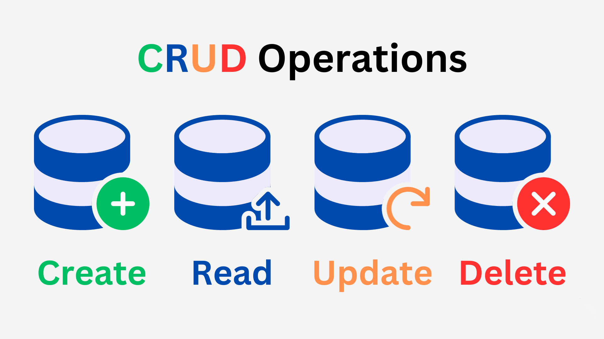

# Contact Book

The project involves developing a Contact Book application that allows users to execute CRUD operations efficiently on their contacts database. The Contact Book will maintain contact details including name, phone number, email, and physical address.

## Understanding CRUD



CRUD is an acronym for Create, Read, Update, and Delete. These are the four basic operations that you can perform on any data. CRUD forms the backbone of most computer software and web applications as these actions describe the essential functionality a system should have to manage data or a database.

- __Create:__  This involves the creation of new entries of data into the database.
- __Read:__ This concerns activities related to the retrieval or viewing of existing entries. Data in the database remains unchanged.

- __Update:__ This involves the modification or update of existing data. It requires identifying the existing data in the database and then updating it with new information.
- __Delete:__ This involves the deletion or removal of existing entries from the database.

Learning how to work with CRUD operations is a cornerstone of understanding how to build applications that persist and manipulate data. Our proposed Contact Book project is designed to help you grasp these concepts by implementing CRUD operations on your contacts database.

## Project Structure

The structure of the project includes:

```
.
├── README.md
├── requirements.txt
└── src
    ├── contact_book.py
    └── main.py
```
- `README.md`: this document providing project description and documentation
- `requirements.txt`: Python requirements file
- `src/contact_book.py`: the Python script that defines the ContactBook class which encapsulates the core functionalities of the application
- `src/main.py`: the main script which interacts with the user and uses ContactBook class methods to provide the desired functionality

### ContactBook Class

The core logic of the application is implemented in `ContactBook` class:

- The `add_contact` method allows for new entries to be made to the 'book'. Each entry must be unique by name.

- The `edit_contact` method permits updates to contact information.

- The `view_contacts` method lists all contacts in the address book along with their information.

- The `delete_contact` method allows for existing contacts to be removed from the book.

The `main.py` file serves as an interface between the user and the `ContactBook` class instance. It gets user inputs, calls the necessary methods and handles the application flow.

## User Interface

The interface is a simple console-based menu that offers users options to add, view, edit, delete contacts or quit the program.

## Requirements

- Python 3.14

Installation of required packages can be executed using pip:

```
pip install -r requirements.txt
```
## Installation and Usage

To run the program, navigate to the project directory and run the following command:

```
python main.py
```
   