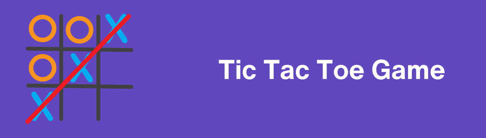

# Tic-Tac-Toe Project

## Description

This project is an implementation of the classic game Tic-Tac-Toe with Python. The players mark their spaces with an 'O' or an 'X' on a nine-square grid. The goal of the game is to mark three 'O's or 'X's diagonally, horizontally, or vertically. The game uses Python's object-oriented programming concepts to declare a TicTacToe class with properties and methods to represent the game's features. Moreover, the Python random module is used to randomly select the player to start the game.

## Project Structure

The project is organized into a single Python file: `tictactoe.py`. This file contains the TicTacToe class along with its properties and methods. 

Here is a brief overview of the class methods:

tictactoe.py
- TicTacToe Class
  - `__init__()` method: initializes the game board and other class attributes and randomly selects the first player.
  - `get_random_first_player()` chooses whether 'X' or 'O' will play first.
  - `fix_spot()` allows a player to mark a cell on the board.
  - `has_player_won()` checks if a player has won the game.
  - `is_board_filled()` checks if the game board is completely filled.
  - `swap_player_turn()` toggles the active player.
  - `show_board()` prints out the current state of the game board.
  - `start()` begins the game loop, processing user input and game updates.

  - print_board method: prints the current state of the game board
  - play method: enables a player to make a move
  - check_winner method: determines the winner of the game

## Requirements

- Python 3.x installed

## Hints

- Represent the empty spaces in the board by filling them initially with numbers from 1 to 9.
- Use a 2-D list to represent the game board in Python.
- Draw the initial state of the board using a formatted string.
- Use a Python set to represent the remaining valid cells.
- Use the magic method str to return the string representation of the game board state.

## 