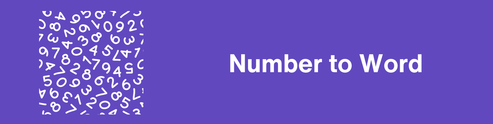

# 🔢 Number to Words

A simple Python project that converts numbers into their **English word representation**.

For example:

```text
128 → One Hundred Twenty Eight
28  → Twenty Eight
1354 → One Thousand Three Hundred Fifty Four
```

The project uses a "recursive function" to break a number into smaller parts and convert each part into words.

---

## ✨ Features

* 🔢 Convert integers into English words
* 🔄 Uses a recursive approach
* 📚 Supports numbers up to the **Trillion** range
* 🧩 Separates constants from the main logic
* 🧪 Includes simple built-in tests using `assert`
* 📖 Includes a documented `num_to_word()` function
* 🐍 Written entirely in Python

---

## 📁 Project Structure

The project contains a `src` directory with two Python files:

```text
Number-to-Words/
│
├── src/
│   ├── constants.py
│   └── main.py
│
└── README.md
```

### `src/constants.py`

This file contains the word constants used by the conversion function.

It defines three main variables:

#### `UNDER_20`

Contains English words for numbers from `0` to `19`.

```python
UNDER_20 = [
    "Zero", "One", "Two", "Three", "Four",
    "Five", "Six", "Seven", "Eight", "Nine",
    "Ten", "Eleven", "Twelve", "Thirteen",
    "Fourteen", "Fifteen", "Sixteen",
    "Seventeen", "Eighteen", "Nineteen",
]
```

#### `TENS`

Contains the words for multiples of ten:

```text
20  → Twenty
30  → Thirty
40  → Forty
50  → Fifty
60  → Sixty
70  → Seventy
80  → Eighty
90  → Ninety
```

#### `ABOVE_100`

Contains the names of larger number units:

```text
100              → Hundred
1,000            → Thousand
1,000,000        → Million
1,000,000,000    → Billion
1,000,000,000,000 → Trillion
```

---

## 🧠 `src/main.py`

This file contains the main conversion function:

```python
num_to_word(num: int) -> str
```

The function receives an integer and returns its English word representation.

Example:

```python
num_to_word(128)
```

returns:

```text
One Hundred Twenty Eight
```

---

## 🔄 How It Works

The conversion function handles numbers in different ranges.

### 1. Numbers Less Than 20

For numbers from `0` to `19`, the function directly accesses `UNDER_20`.

```python
num_to_word(10)
```

Result:

```text
Ten
```

---

### 2. Numbers From 20 to 99

For numbers between `20` and `99`, the function separates the tens and ones.

For example:

```text
28
```

is divided into:

```text
20 + 8
```

The function gets:

```text
Twenty
```

from `TENS` and:

```text
Eight
```

from `UNDER_20`.

The final result is:

```text
Twenty Eight
```

---

### 3. Numbers Greater Than or Equal to 100

For larger numbers, the function finds the largest available number unit that is less than or equal to the input.

For example:

```text
1354
```

The largest suitable unit is:

```text
1000 → Thousand
```

The number is then divided into:

```text
1 × 1000
```

and the remainder:

```text
354
```

The function recursively converts both parts.

This produces:

```text
One Thousand Three Hundred Fifty Four
```

---

## 🔁 Recursive Approach

One of the main concepts demonstrated by this project is **recursion**.

The function calls itself when it needs to convert the remainder of a larger number.

For example:

```text
1354
```

can be thought of as:

```text
1 Thousand + 354
```

Then:

```text
354
```

becomes:

```text
3 Hundred + 54
```

And:

```text
54
```

becomes:

```text
Fifty + Four
```

So the final result is:

```text
One Thousand Three Hundred Fifty Four
```

---

## 🧮 Examples

Here are some examples of numbers and their corresponding results:

|       Number | Result                                                   |
| -----------: | -------------------------------------------------------- |
|          `0` | Zero                                                     |
|         `10` | Ten                                                      |
|         `20` | Twenty                                                   |
|         `28` | Twenty Eight                                             |
|        `100` | One Hundred                                              |
|        `128` | One Hundred Twenty Eight                                 |
|      `1,000` | One Thousand                                             |
|      `1,354` | One Thousand Three Hundred Fifty Four                    |
|     `65,872` | Sixty Five Thousand Eight Hundred Seventy Two            |
| `10,054,698` | Ten Million Fifty Four Thousand Six Hundred Ninety Eight |
|      `1,300` | One Thousand Three Hundred                               |

---

## 🚀 How to Run

First, open a terminal in the project directory.

Because `main.py` is inside the `src` directory, run:

```bash
python src/main.py
```

If your system uses `python3`, use:

```bash
python3 src/main.py
```

---

## 💻 Expected Output

Running:

```bash
python src/main.py
```

will execute the examples included in the `__main__` section.

The program prints:

```text
One Hundred Twenty Eight
Twenty Eight
One Thousand Three Hundred Fifty Four
Sixty Five Thousand Eight Hundred Seventy Two
Ten Million Fifty Four Thousand Six Hundred Ninety Eight
One Thousand Three Hundred
All tests passed!
```

---

## 🧪 Testing

The project includes basic tests using Python's built-in `assert` statement.

For example:

```python
assert num_to_word(128) == "One Hundred Twenty Eight"
assert num_to_word(28) == "Twenty Eight"
```

If all assertions pass, the program prints:

```text
All tests passed!
```

If an assertion fails, Python raises an `AssertionError`.

---

## 📖 Docstring

The `num_to_word()` function also includes a docstring with examples:

```python
def num_to_word(num: int) -> str:
    """
    Convert a number to its word representation.

    >>> num_to_word(0)
    'Zero'

    >>> num_to_word(10)
    'Ten'

    >>> num_to_word(128)
    'One Hundred Twenty Eight'
    """
```

These examples can also serve as documentation for how the function is expected to behave.

---

## 🛠️ Technologies Used

This project uses:

* 🐍 **Python 3**
* 🔄 Recursion
* 📦 Python modules
* 🧪 `assert` statements for basic testing
* 📝 Python docstrings

No external packages are required.

---

## 📋 Requirements

The project does not require any third-party libraries.

You only need:

```text
Python 3.x
```

You can check your Python version with:

```bash
python --version
```

or:

```bash
python3 --version
```

---

## 🎯 Purpose of the Project

This project is useful for practicing several important Python concepts:

* Functions
* Type hints
* Recursion
* Lists
* Dictionaries
* Modules and imports
* Conditional statements
* Integer division
* Remainders using `%`
* Assertions
* Docstrings
* Separating data/constants from application logic

---

## 🔮 Possible Future Improvements

Some possible improvements for future versions include:

* ➖ Support negative numbers
* 🔢 Support decimal numbers
* 🌍 Add support for other languages
* 🔤 Add an option for different capitalization styles
* 🧪 Create a complete test suite using `pytest`
* ⌨️ Add interactive user input
* 📦 Convert the project into an installable Python package
* 📝 Add more extensive documentation
* 🔍 Add input validation
* ⚠️ Handle invalid input more gracefully

---

## ⚠️ Current Limitations

The current implementation is designed for non-negative integer values.

It does not currently provide special handling for:

* Negative numbers
* Decimal/floating-point numbers
* Invalid input types
* Numbers larger than the supported `Trillion` range

For normal integer values within the supported range, the function recursively builds the English representation.

---

## 📌 Example Usage

You can import the function into another Python file:

```python
from src.main import num_to_word

result = num_to_word(128)

print(result)
```

Output:

```text
One Hundred Twenty Eight
```

---

## 👨‍💻 Author

This project was created as a Python learning project focused on:

* Recursive functions
* Number processing
* Python modules
* Clean separation of constants and logic

---

## ⭐ Conclusion

**Number to Words** is a small but useful Python project that demonstrates how recursion can be used to convert numerical values into readable English words.

The project keeps the number-related constants in `constants.py` while the conversion logic is implemented in `main.py`, making the code simple and easy to understand.
